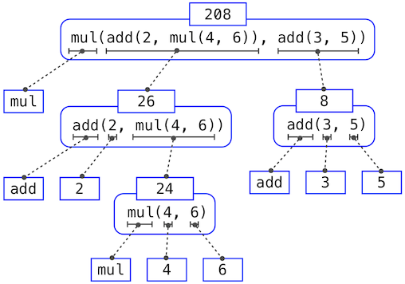

  
## 编程要素

每一种强大的语言都有三种机制：

- **原始表达式和语句**：最小元素
- **组合方法**：由最小元素组合构建复合元素
- **抽象方法**：命名复合元素，并将其作为单元进行操作

在编程中，我们只会处理函数和数据。<u>数据是我们想要操作的东西，而函数是操作这些数据的规则的描述。</u>

### 运算符

除了常见的 `+, -, *, /` 以外，还有求幂 `**` 以及整除 `//`，特别要注意整除在面对 **除数为正负数** 的时候不同的机制。


```python
>>> 5 // 4
1
>>> -5 // 4
-2
```

### 表达式

首先从最符合直觉的 **中缀表达式** 开始，即运算符出现在操作数之间。


```python
>>> 1/2 + 1/4 + 1/8 + 1/16 + 1/32 + 1/64 + 1/128 
0.9921875
```

**调用表达式**，即将函数运用于一些参数上。

```python
>>> max(7.5, 9.5)
9.5
```

**嵌套表达式**，其元素本身就是一个复合表达式

```python
>>> mul(add(2, mul(4, 6)), add(3, 5))
208
```

求解嵌套表达式的方法为构建 **表达式树**，从叶子结点开始计算，而后慢慢延伸至根节点。



### 名称与环境

考虑一个简单的 **赋值** 操作：


```python
>>> from math import pi
>>> pi * 71 / 223
1.0002380197528042
```

赋值将名称与值进行绑定，之后通过名称检索可能的值，就意味着解释器 **必须维护某种内存来记录名称、值和绑定**，这种内存就是 **环境**。环境为表达式的求解提供了上下文信息，对理解程序执行过程有着重要作用。

在 Python 中，名称通常被称为 **变量**，因为他们在执行过程中可以与不同的值或函数进行绑定。且更改一个变量的值不会影响其他已经赋值的变量。

### 纯函数与非纯函数

- **纯函数（Pure functions）**：函数有一些输入（参数）并返回一些输出（调用返回结果）
- **非纯函数（Non-pure functions）**：除了返回值外，调用一个非纯函数还会产生其他改变解释器和计算机的状态的副作用

一个常见的副作用就是使用 `print` 函数产生（非返回值的）额外输出，而其默认的返回值为 None。

```python
>>> print(print(1), print(2))
1
2
None None
```

## 定义函数

函数定义为一种强大的抽象机制，它可以将 **名称和复合操作绑定** 为一个单元。

首先定义形式参数和实际参数：

- **形式参数**：函数定义时的变量，表示函数期望接收的数据类型和数量
- **实际参数**：调用函数时提供的具体值，这些值会被复制到对应的形式参数中，供函数内部使用

例如计算一个数的平方的函数：

```python
def square(x: int | float):
    return mul(x, x)
```

其中 `x` 是形式参数，而传递进这个函数的值为实际参数。`int|float` 表示实际参数的类型为 `int` 或 `float`。

有了函数定义之后，我们需要考虑的问题是如果存在两个同名的函数怎么办？形式参数与内置函数同名怎么办？为了解决这些问题，我们需要更加详细地描述环境。

### 环境的描述

环境由一系列的帧（Frame）按特定顺序组成，通常以栈（Stack）的形式组织，最新的帧位于栈顶，最旧的帧位于栈底（先入后出）。

>有关栈的讲解：https://www.hello-algo.com/chapter_stack_and_queue/stack/

帧可以看作是一个黑盒，其中包含了一些名称和值的绑定。分为全局帧和局部帧：

- **全局帧**：整个程序执行过程中唯一且最底层的帧，负责存储全局变量和函数定义
- **局部帧**：每次函数被调用的时候创建的，用于存储该函数的形式参数和局部变量

环境内部的查找规则（表达式的求解过程）：

1. **从当前帧开始** ：首先在当前帧（通常是最新的局部帧）中查找变量绑定
2. **逐层向下查找** ：如果在当前帧中找不到，再到下一个较旧的帧中查找，如此类推
3. **最终查找全局帧** ：如果在所有局部帧中都找不到，最后在全局帧中查找
4. **未找到则报错** ：如果全局帧中也没有对应的绑定，会引发错误（如 `TypeError`）

简要地说：帧构成了环境图，环境图包含了一系列绑定，通过在环境图中至上而下地搜索这些绑定来求解表达式。

>这种搜索的操作也被称为 **名称求解**（Name Evaluation）。

### 抽象函数

思考抽象函数的三个核心属性通常对掌握其使用很有帮助。

- **函数的域**： 是它可以接受的参数集合
- **函数的范围**： 是它可以返回的值的集合
- **函数意图** ：是计算输入和输出之间的关系（以及它可能产生的任何副作用）

这些属性不会描述函数是如何执行的，因为这个细节已经被抽象掉了。

### 设计一个好的函数

一个好的函数应该强化 “函数就是抽象” 的理念。

- 每个函数应该只负责一个任务，且该任务能用一个简短的名称来识别
- 多个代码片段不应该描述重复的逻辑，即软件工程的 DRY 原则
- 定义通用的函数
- 函数主体中使用的大多数形式参数值都应该表示为具名参数
- 添加函数文档（docstring）

```python
>>> def pressure(v, t, n=6.022e23):
        """计算理想气体的压力，单位为帕斯卡

        使用理想气体定律：http://en.wikipedia.org/wiki/Ideal_gas_law

        v -- 气体体积，单位为立方米
        t -- 绝对温度，单位为开尔文
        n -- 气体粒子，默认为一摩尔
        """
        k = 1.38e-23  # 玻尔兹曼常数
        return n * k * t / v
```

> **具名参数** （Named Arguments），也称为 **关键字参数** ，是在函数调用时通过参数名称来传递值的方式。与 **位置参数** （Positional Arguments）不同，具名参数不依赖于参数的顺序，而是通过指定参数名来确定每个参数的值。上述代码中中 `n` 为具名参数，`v, t` 为位置参数。

## 控制

控制语句将赋予我们根据布尔上下文比较的结果来执行不同的语句。

首先定义条件语句和布尔上下文：

```python
if <expression>:
    <suite>
elif <expression>:
    <suite>
else:
    <suite>
```

其中 `<expression>` 被称为 **布尔上下文**，其比较的方式为布尔运算符（与、或、非）：

```python
>>> true and false
false
>>> true or false
true
>>> not false
true
```

我们观察第二个或运算的例子 `true or false` 可以直接得出求值结果为 `true`，这一特性也被称为 **短路**（short-circuiting）。

>Python 中的假值包括 `0`、`None` 和布尔值 `false`。内置运算符包括 `>, <, >=, <=, ==, !=`。

这些值、规则和运算符为我们提供了一种组合比较结果的方法。执行单个比较并返回布尔值的函数通常以 `is` 开头，后面不跟下划线（例如 `isfinite, isdigit, isinstance` 等）。

**迭代控制**（Iterative control）结构是一种多次执行相同语句的机制，还有一种是函数。

例如计算斐波那契数列：

```python
def fib(n):
	"""Compute the nth Fibonacci number, for n >= 2."""
	pred, curr = 0, 1   # Fibonacci numbers 1 and 2
	k = 2               # Which Fib number is curr?
	while k < n:
		pred, curr = curr, pred + curr
		k = k + 1
	return curr	
	
result = fib(8)
```

## 测试

测试一个函数就是去验证函数的行为是否符合预期。常见的有三种形式：

**断言（Assertions）** ：适用于简单的条件检查和调试；

```python
>>> assert fib(8) == 13, '第八个斐波那契数应该是 13'
```

**文档测试（Doctests）** ：适用于为函数提供示例并自动 验证这些示例的正确性；

```python
>>> def sum_naturals(n):
        """返回前 n 个自然数的和。

        >>> sum_naturals(10)
        55
        >>> sum_naturals(100)
        5050
        """
        total, k = 0, 1
        while k <= n:
            total, k = total + k, k + 1
        return total
```

而后可以使用 doctest 模块或者 doctest 命令行进行测试，这里介绍一下命令行的用法：

```python
python3 -m doctest <python_source_file>
```

 **单元测试（Unit Tests）** ：适用于系统化、全面地测试代码中的各个独立单元，确保其在各种情况下都能正常工作。常见的库有 unittest 和 pytest。

## 高阶函数

高阶函数 （Higher-Order Function）是指满足以下条件之一的函数：

- 接收一个或多个 **函数** 作为参数
- 返回另一个 **函数** 作为结果

常见内置高阶函数：

-  `map()`: 对可迭代对象的每个元素应用指定函数
- `filter()`: 过滤可迭代对象中满足条件的元素
- `sorted()`: 根据指定函数对可迭代对象进行排序
- `reduce()`: 累积可迭代对象中的元素（需从`functools`模块导入）

应用场景：

- **回调函数** ：在异步编程或事件驱动编程中，高阶函数常用于定义回调逻辑
- **装饰器** ：通过高阶函数动态地修改或增强函数的行为
- **函数组合** ：将多个函数组合成一个新的函数，实现复杂的操作流程

> 回调函数 （Callback Function）是指作为参数传递给另一个函数，并在特定事件或条件发生时被调用执行的函数。


### 作为参数的函数

将函数作为参数传递给另一个函数，这样做的好处是可以对同一类型的逻辑处理定义通用的模版，通过添加不同的槽位（slots）来生成不同的函数。

```python
def <name>(n):
    total, k = 0, 1
    while k <= n:
        total, k = total + <term>(k), k + 1
    return total
```

### 作为通用方法的函数

用一些函数来表达计算的通用方法，且与它们调用的特定函数无关，这是一种更强大的抽象方法。

```python
>>> def improve(update, close, guess=1):
        while not close(guess):
            guess = update(guess)
        return guess
```

例如上述代码定义了迭代改进的通用方法，与传递的函数具体形式无关，只与传递的函数的用途有关。即 `update` 用来更新改进，`close` 用来判断改进是否与目标接近。

这里注意一下判断两个数是否接近的方法：

```python
>>> def approx_eq(x, y, tolerance=1e-15):
        return abs(x - y) < tolerance
```

### 作为嵌套定义的函数

我们通过查看一个具体的例子来描述这个定义：计算一个数的平方根

```python
def average(x, y):
	  return (x + y) / 2

def sqrt(a):
    def sqrt_update(x):
        return average(x, a / x)
    def sqrt_close(x):
        return approx_eq(x * x, a)
    return improve(sqrt_update, sqrt_close)
```

然后查看其环境图，这样的好处是能够更好理解函数的层次关系以及词法作用域的概念。

> 词法作用域（Lexical scope）：局部定义的函数可以访问整个父级定义作用域内的名称绑定。


> 上述环境图的具体链接：[环境图](https://pythontutor.com/render.html#code=def%20average%28x,%20y%29%3A%0A%20%20%20%20return%20%28x%20%2B%20y%29/2%0A%0Adef%20improve%28update,%20close,%20guess%3D1%29%3A%0A%20%20%20%20while%20not%20close%28guess%29%3A%0A%20%20%20%20%20%20%20%20guess%20%3D%20update%28guess%29%0A%20%20%20%20return%20guess%0A%0Adef%20approx_eq%28x,%20y,%20tolerance%3D1e-3%29%3A%0A%20%20%20%20return%20abs%28x%20-%20y%29%20%3C%20tolerance%0A%0Adef%20sqrt%28a%29%3A%0A%20%20%20%20def%20sqrt_update%28x%29%3A%0A%20%20%20%20%20%20%20%20return%20average%28x,%20a/x%29%0A%20%20%20%20def%20sqrt_close%28x%29%3A%0A%20%20%20%20%20%20%20%20return%20approx_eq%28x%20*%20x,%20a%29%0A%20%20%20%20return%20improve%28sqrt_update,%20sqrt_close%29%0A%0Aresult%20%3D%20sqrt%28256%29&cumulative=false&curInstr=10&heapPrimitives=nevernest&mode=display&origin=opt-frontend.js&py=3&rawInputLstJSON=%5B%5D&textReferences=false)

有了上面的环境图之后，根据名称查找的方法，Python 首先在 `sqrt_update` 帧中进行检查，发现不存在 `a` ，然后又到 `sqrt_update` 的父帧 `f1` 中进行检查，发现 `a` 被绑定到了 256。

这个求值过程最关键的部分是将 `sqrt_update` 的父环境变成了通过调用 `sqrt_update` 创建的局部帧，此帧还带有 `[parent=f1]` 的父级注释。

这里就引出了 **闭包**（closures）的概念，其中 `sqrt_update` 和 `sqrt_close` 为回调函数，作为参数传递给 `improve` 函数。而闭包指的是回调函数可以访问外部作用域的变量。

### 作为返回值的函数

这里有一点要说明，即带有词法作用域的编程语言的一个重要特性就是：局部定义的函数在它们返回时仍然保留其关联的环境。

### Lambda 表达式

Lambda 表达式是一种创建匿名（没有名字）函数的简洁方式，且不允许使用赋值和控制语句。

```python
square = lambda x: x ** 2
```

### 函数装饰器

函数装饰器（Decorator）是一种在不修改原函数代码的情况下，动态添加额外功能的工具。在 Python 中，装饰器通常是一个接受函数作为参数并返回一个新函数的函数。

```python
>>> def trace(fn):
        def wrapped(x):
            print('-> ', fn, '(', x, ')')
            return fn(x)
        return wrapped

>>> @trace
    def triple(x):
        return 3 * x

>>> triple(12)
->  <function triple at 0x102a39848> ( 12 )
36
```

还有一种更高级的写法，即在装饰器符号 `@` 后跟一个调用表达式，这种方式允许装饰器接受参数，提供了更大的灵活性和可配置性。

```python
def decorator_factory(arg1, arg2):
    def decorator(func):
        def wrapper(*args, **kwargs):
            # 添加额外功能
            return func(*args, **kwargs)
        return wrapper
    return decorator

@decorator_factory('参数1', '参数2')
def my_function():
    pass
```

### 柯里化

柯里化（Currying）是一种将接受多个参数的函数转换为一系列只接受一个参数的函数的技术。通过柯里化，可以逐步传递参数，每次传递一个参数，直到所有参数都被提供，最终执行函数。

## 递归函数

如果函数体中直接或间接调用了函数本身，则函数称为递归（recursive）函数。许多递归函数存在一种常见的模式：

- 以一个基线条件开始，他为最容易处理的输入定义了函数的行为
- 后面有一个或多个递归调用，递归调用的特点是，他们简化了原始问题，逐步逼近基线条件

### 递归函数剖析

我们从一个求解一个整数所有位数之和的示例开始：

```python
>>> def sum_digits(n):
        """返回正整数 n 的所有数字位之和"""
        if n < 10:
            return n
        else:
            all_but_last, last = n // 10, n % 10
            return sum_digits(all_but_last) + last
```

> 强烈建议观看[环境图](https://pythontutor.com/visualize.html#code=def%20sum_digits%28n%29%3A%0A%20%20%20%20if%20n%20%3C%2010%3A%0A%20%20%20%20%20%20%20%20return%20n%0A%20%20%20%20else%3A%0A%20%20%20%20%20%20%20%20all_but_last,%20last%20%3D%20n%20//%2010,%20n%20%25%2010%0A%20%20%20%20%20%20%20%20return%20sum_digits%28all_but_last%29%20%2B%20last%0A%0Asum_digits%28738%29&cumulative=false&heapPrimitives=nevernest&mode=edit&origin=opt-frontend.js&py=3&rawInputLstJSON=%5B%5D&textReferences=false)的执行步骤，能够加强对递归的理解。

最好理解递归的方法就是将递归调用看作是一种函数的抽象行为，我们根据函数自身来定义一个函数，但在验证函数的正确性时，我们只需相信在更简单的情况下，函数同样能正确工作。这样，验证递归函数的正确性实际上变成了一种归纳法（induction）的证明形式。

### 互递归

当一个递归过程被划分到两个相互调用的函数中时，这两个函数被称为是互递归的（mutually recursive）。

### 树递归

树递归（tree recursion） 是一种递归调用模式，其中一个函数在其递归过程中调用自身多次，导致递归调用呈树状分支。最典型的例子就是计算斐波那契数列。

```python
def fib(n):
    if n == 1:
        return 0
    if n == 2:
        return 1
    else:
        return fib(n-2) + fib(n-1)

result = fib(6)
```

可以和迭代控制处的代码进行比较。

### 示例：分割数

求正整数 $n$ 的分割数，最大部分为 $m$，即 $n$ 可以分割为不大于 $m$ 的正整数的和，并且按递增顺序排列。

为了理解问题，我们将分割方式分为两类：

- 包含至少一个 $m$ 的分割方式
- 不包含任何 $m$ 的分割方式

首先查看第一种。如果一个分割方式至少包含一个 $m$，那么就可以从这个分割中去掉一个 $m$，那么剩余的数就变成了 $n-m$，也就是将 $n-m$ 分割，其中最大加数不能超过 $m$。

再来看第二种。如果一个分割方式不包含 $m$，那么所有的加数都小于 $m$，也就是将 $n$ 分割，其中最大加数不能超过 $m-1$。

通过树递归的定义可以观察到：

- 包含至少一个 $m$ 的分割方式数量等于将 $n-m$ 分割为最大加数不超过 $m$ 的方式数量
- 不包含任何 $m$ 的分割方式数量等于将 $n$ 分割为最大加数不超过  $m-1$ 的方式数量

因此，所有使用最大数为 $m$ 的整数分割 $n$ 的方式的总数，等于这两类分割方式的数量之和：

$$
P(n, m)=P(n-m,m)+P(n,m-1)
$$

代码为：

```python
def count_partitions(n, m):
    """计算使用最大数 m 的整数分割 n 的方式的数量"""
    if n == 0:
        return 1
    elif n < 0:
        return 0
    elif m == 0:
        return 0
    else:
        return count_partitions(n-m, m) + count_partitions(n, m-1)
```
